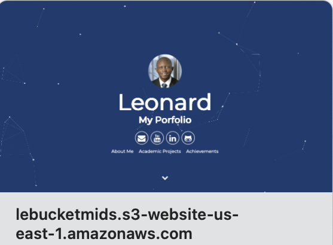

**Some Gitlab projects**  

<a href="http://lebucketmids.s3-website-us-east-1.amazonaws.com" target="_blank">Gitlab projects portfolio on a Zola website.</a>
   

 
**Some companies I’ve collaborated with on projects**  
Innovatrics, Slovakia   
Diletta GmbH, Germany   
Muehlbauer AG, Germany   
Adaptive Recognition, Hungary   
OeSD, Austria   
Xinfotech Ltd, Latvia   
Cetis d.d., Slovania   
Masktech GmbH, Germany   
 

**Playing with my Arduino Uno R4 Wifi**  
I enjoy working with the Arduino board which also has the versatile ESP32 chip on board. It's a joy to work at the interface of hardware and software and try the different things you can turn a microprocessor into through software.

  

**Mobile Biometric Data Enrolment Unit**  

  

I designed a Mobile Biometric Data Enrolment Unit from scratch through several iterations. A total of over 50 units have been developed and deployed so far for the capturing or enrolling of biometric and biodata of applicants of Ghanaian and Liberian passports around the world including most of their embassies. These units have all the components required, namely a laptop, fingerprint scanner, camera, tripod, signature pad, centralised power supply, receipt printer and document scanner, all in one Pelican case with one external power plug powering all the items in the case. Extensive research was done on which components could work together, their specifications and their sizes relative to the total size available in the case. A number of custom foams have been designed with 3D CAD software depending on the specific types of the above equipment in a given unit and are custom cut to hold the equipment safely in the case.

 

**An Ecommerce Site I started**  

  

An Ecommerce Platform under development. It was written in ASP.Net Webforms and runs on MS SQL database using Telerik Controls.
<a href="http://testshop.oxygenegroup.com" target="_blank">See the test site here</a>

 

**Human Resource and Payroll Management Software**  

This is a Human Resource Management and Payroll Software used by a company with multiple desktop clients. It's 3-tiered and runs on Microsoft SQL Server. It was developed with C#.

A screenshot of the Client System.

  

A screenshot of the Server.

  

 
**Other Significant Projects**   
I don't have the permission of the clients to put these projects here but an overview can be provided upon request. Just contact me.